# Comparing the monogenic signal of potential-field data to other edge-detection filters  
Joshua Poirier  
NEOS Geoscientist  
May 2017  

### Abstract  

The purpose of this repository is to compare edge-detection filters as applied
to geophysical potential-field data. In the May-June 2017 issue of
**Geophysics** (published by the
[Society of Exploration Geophysicists](http://seg.org/)), Hidalgo-Gato and
Barbosa published a Python code yielding the local amplitude, local phase, and
local orientation of the nonscale and the Poisson's scale-space monogenic
signals. The code is open source and is freely available from the SEG
[here](http://software.seg.org/2017/0002/). Here, I compare Hidalgo-Gato and
Barbosa's results with some popular edge detection filters based on derivatives.
To do this, I will apply the filters to Hidalgo-Gato and Barbosa's synthetic
data set (published with their code) and a real-world data set **TODO TODO TODO
TODO TODO TODO TODO TODO**.

### Introduction  

Hidalgo-Gato and Barbosa's recently published paper *The monogenic signal of
potential-field data: A Python implementation* appeared in the May-June 2017
issue of **Geophysics**. It publishes and demonstrates codes to calculate the
local amplitude, local phase, and local orientation of the non-scale and the
Poisson's scale-space monogenic signals of potential-field data. However, they
did not compare their results to commonly used filters whose primary purpose is
edge detection. Some examples of popular edge detection filters include the 2D
analytic signal (Nagibhian 1972), the total gradient (Roest et al. 1992), the
tilt angle (Miller and Singh 1994), fractional vertical derivatives (Cooper
2003), and the hyperbolic tilt (Cooper 2006, 2013).  

The biggest problem with most edge detection filters based on derivatives
(notably those utilizing the vertical derivative) is that they simultaneously
enhance noise content. For this reason, the monogenic signal attributes were
proposed as a set of filters based on the Riesz transform - using not only the
derivatives of the data (Hassan and Yalamanchili 2013). The monogenic signal is
an image processing tool which can be applied to any image data (Felsberg and
Sommer 2001).  

### The synthetic model  

To compare the filters I will use the model and data provided by Hidalgo-Gato
and Barbosa, 2017. It is a 3D synthetic model illustrating a crustal thinning
geologic setting in a passive margin basin. The dashed lines in the figure below
denote a dike, the hinge line of the continental crust, the continental-oceanic
crust boundary (COB), and an igneous intrusion within the oceanic crust.  

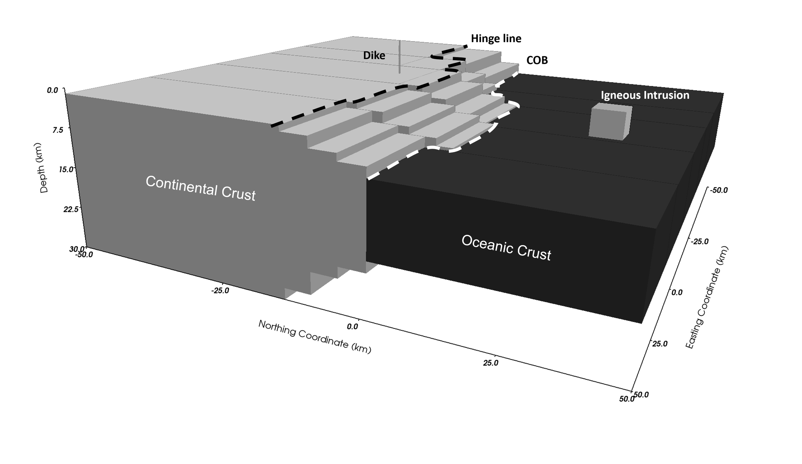  

The magnetic basement is magnetized by induction uniformly with an intensity of
2.5 A/m for the oceanic crust and 1.5 A/m for the continental crust. The igneous
intrusion and the dike are magnetized by induction with an intensity of 2.8 A/m.
All bodies were magnetized in the direction of -10 degrees (inclination) and -20
degrees (declination). Hidalgo-Gato and Barbosa, 2017 note that the edges of the
bodies were extrapolated constantly to avoid edge effects in the magnetic
anomalies. They provide a data set forward modeled from this synthetic model
and has a pseudorandom zero-mean Gaussian noise (2.5 nT standard deviation)
added in. The total field is shown below.  

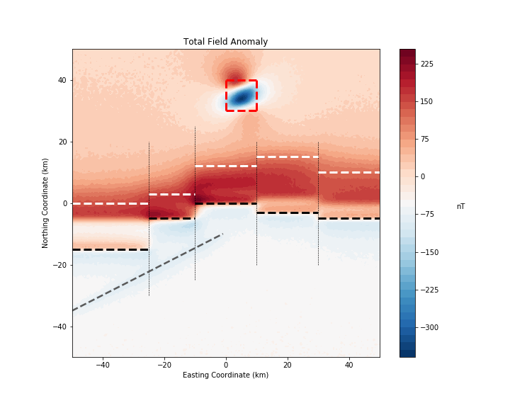

### Applying filters to the synthetic model  

The following highlights different filters applied to the synthetic data set.
Note how the different filters respond differently to the geologic bodies. Each
filter is shown with and without the geologic bodies overlain.  

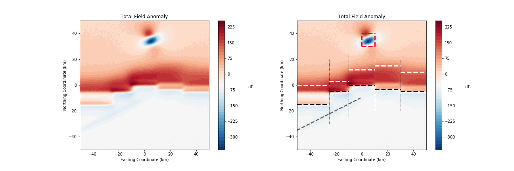
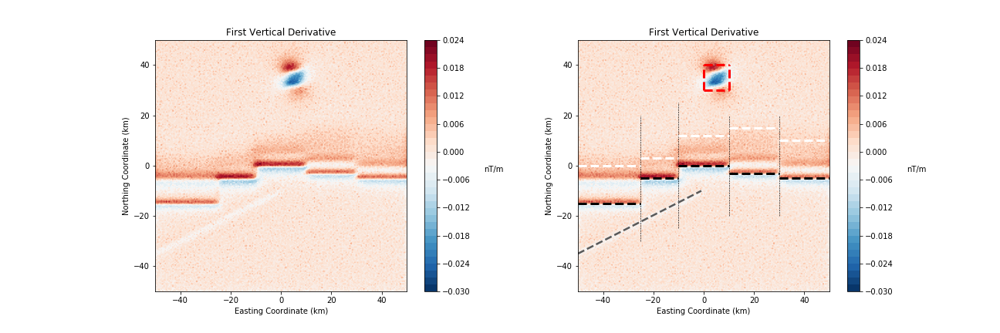
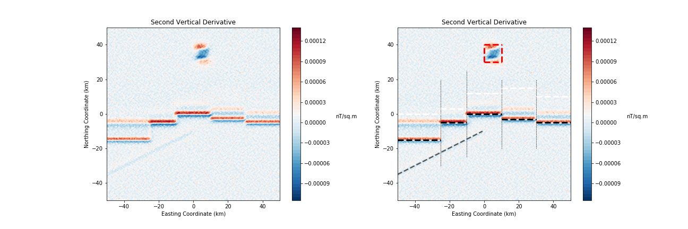
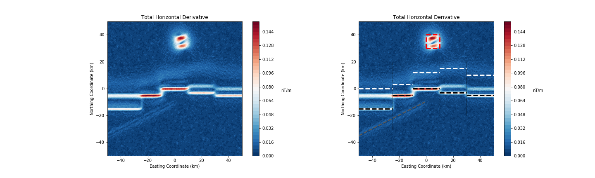
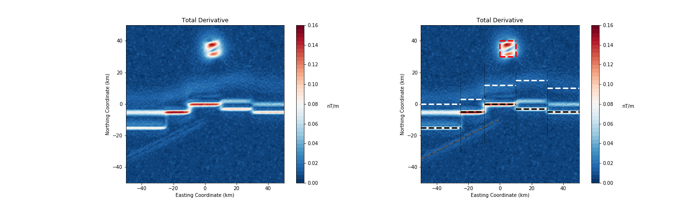
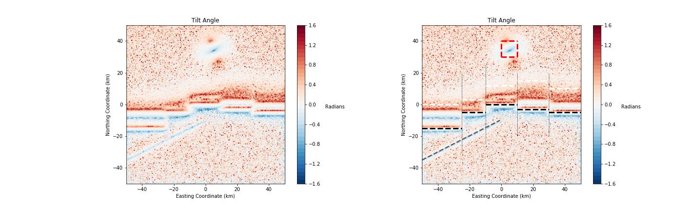
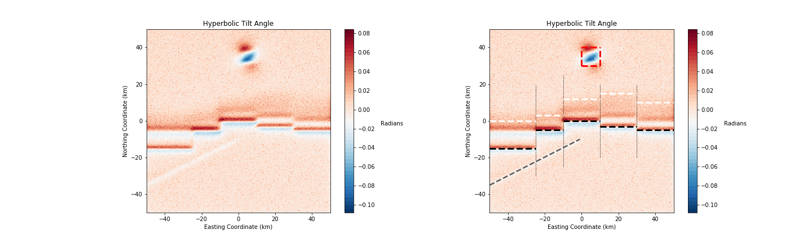
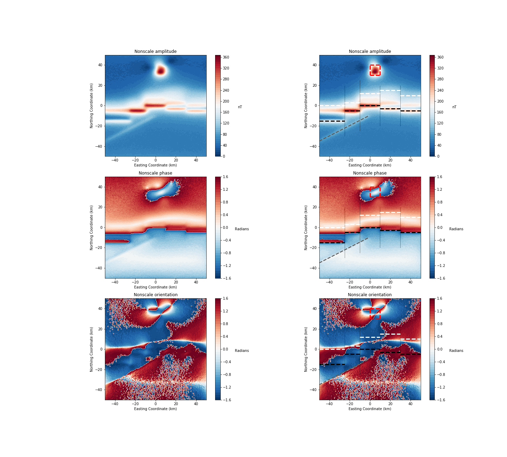
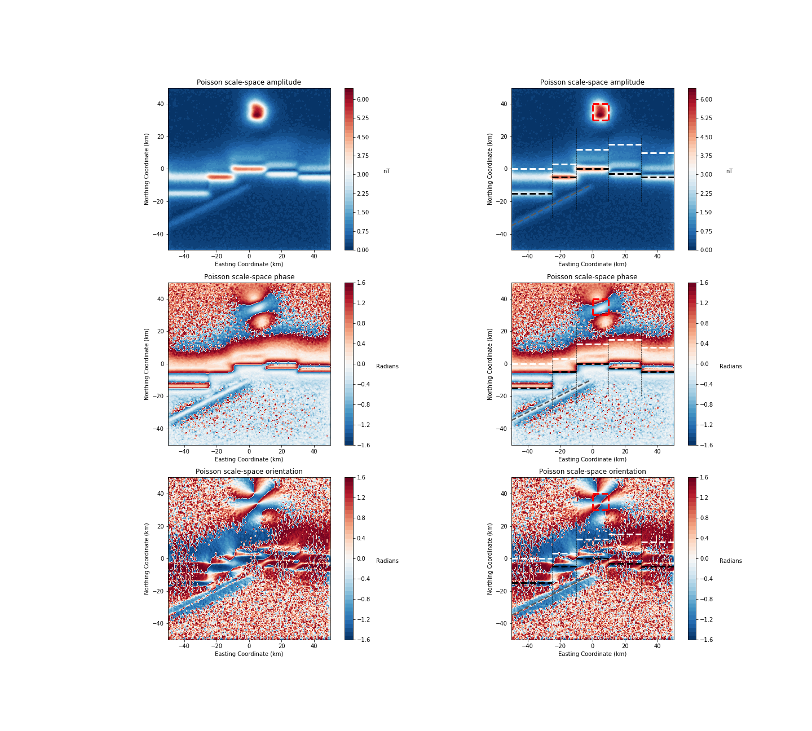

### Real data set  

**TODO TODO TODO TODO TODO**

### Discussion  

**TODO TODO TODO TODO TODO**

### References  

Cooper, G., and D. Cowan, 2003, The application of fractional calculus to
potential field data, Exploration Geophysics, 34, 51-56.

Cooper, G. R. J., D. R. Cowan, 2006. Enhancing potential field data using
filters based on the local phase, Computers & Geosciences, 32, 1585-1591.

Cooper, G., 2013, Reply to a discussion about the 'Hyperbolic tilt angle method'
by Zhou et al., Computers & Geosciences, 52, 496-497.

Felsberg, M., and G. Sommer, 2001, The monogenic signal: IEEE Transactions on
Signal Processing, 49, 3136-3144, doi: 10.1109/78.969520.

Hassan, H. H., and S. V. R. Yalamanchili, 2013, Monogenic signal decomposition:
A new approach to enhance magnetic data: 83rd Annual International Meeting, SEG,
Expanded Abstracts, 1206-1210.

Hidalgo-Gato, M. C. and V. C. F. Barbosa, 2017, The monogenic signal of
potential-field data: A Python implementation: Geophysics, 82, no. 3, F9-F14,
doi: 10.1190/GEO2016-0099.1.

Hidalgo-Gato, M. C. and V. C. F. Barbosa, 2017, Source code repository for "The
monogenic signal of potential-field data: A Python implementation",
http://software.seg.org/2017/0002/, accessed 24 May 2017.

Miller, H. G., and V. Singh, 1994, Potential field tilt: A new concept for
location of potential field sources: Journal of Applied Geophysics, 32, 213-217,
doi: 10.1016/0926-9851(94)90022-1.

Nabighian, M. N., 1972, The analytical signal of 2D magnetic bodies with
polygonal cross-section: Its properties and use for automated anomaly
interpretation: Geophysics, 37, 507-517, doi: 10.1190/1.1440276.

Roest, W. R., J. Verhoef, and M. Pilkington, 1992, Magnetic interpreation using
the 3-D analytic signal: Geophysics, 57, 116-125, doi: 10.1190/1.1443174.
